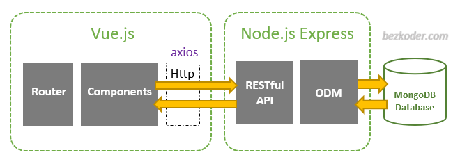

# Web Engineering winter semester 2024/2025

## Goal

Creating a [backend](/server-backend/) for our existing [frontend](/web-frontend/) web app [Podcast player](http://webengineering.ins.hs-anhalt.de:10051)

### Functionality / Progress

Refer to our [Wiki page](https://gitlab.hs-anhalt.de/stempete/webeng2425/-/wikis/Anforderungen-Projektabgabe).

## Team

### Wiederholer++

- Clemens Abraham
- Felix Gahler
- Emil Petersen

## Tech Stack

### "SEVN"

- **SQLite** *(Serverless, quick and easy Database, using an ORM ("Sequelize"))*
- **Express.JS** *(quick and easy node.js-based web backend framework)*
- **Vue 3 CLI** *(component based frontend framework)*
- **Node.JS** *(package manager and js runtime for servers)*



## Installation

### Prerequisites

- [Node.js](nodejs.org): JavaSript runtime. Also used for running scripts and downloading dependencies via [npm](https://www.npmjs.com/).
- [Docker](https://www.docker.com/): Used for containerizing the application. Refer to the Docker documentation for installation instructions.
- [Git](https://git-scm.com/downloads).: Used for cloning the project repository and version control.

### Steps

1. Clone the Repository and go inside the root folder

```
git clone https://gitlab.hs-anhalt.de/stempete/webeng2425.git
cd webeng2425
```

2. Root Project Setup

In the root folder, install dependencies via npm:

```
npm install
```

3. Backend Setup

Navigate to the backend directory and install dependencies:

```
cd server-backend
npm install
```

4. Database Setup

- SQLite should be available in the backend only
- Migrate the database schema using Sequelize:

`npx sequelize-cli db:migrate`

5. Frontend Setup

Navigate to the frontend directory and install dependencies:

```
cd ../web-frontend
npm install
```

6. Run the Application Locally

*Recommended*: Start Front- and Backend in root at once using concurrently and nodemon:

```
cd ..
npm start
```

*OR* Run backend and frontend separately:

- Start the backend server:

```
cd ../server-backend
node index.js
```

Start the frontend server:

```
cd ../web-frontend
npm run serve
```


7. Run with Docker (Optional)

- Build and start the Docker containers:

`docker-compose up --build`

- Access the application at http://localhost:8080 (frontend) and http://localhost:5050 (backend).

## Usage

- Open the application in your browser at the specified URLs.
- Refer to the Wiki page for specific use cases and examples.

## Contributing

- Fork the repository and create a feature branch for your changes.
- Submit a merge request with a clear description of the added functionality.

## License

-

## Contact

For issues or questions, please contact the team members listed above or submit an issue in the GitLab repository.